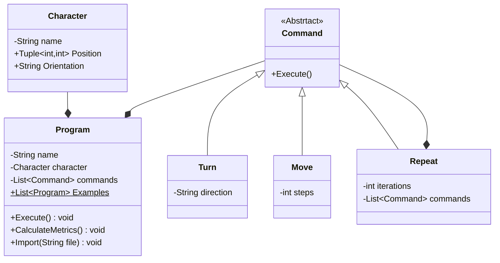

```mermaid
classDiagram
    Command --* Program
    Command <|-- Turn
    Command <|-- Move
    Command <|-- Repeat
    Command --* Repeat
    Character --* Program

    class Command{
        <<Abstrtact>>
        +Execute()
    }
    class Turn{
        -String direction
    }
    class Move{
        -int steps
    }
    class Repeat{
        -int iterations
        -List~Command~ commands
    }
    class Character{
        -String name
        +Tuple~int,int~ Position
        +String Orientation
    }
    class Program{
        -String name
        -Character character
        -List~Command~ commands
        +List~Program~ Examples$
        +Execute() void
        +CalculateMetrics() void
        +Import(String file) void
    }
```
