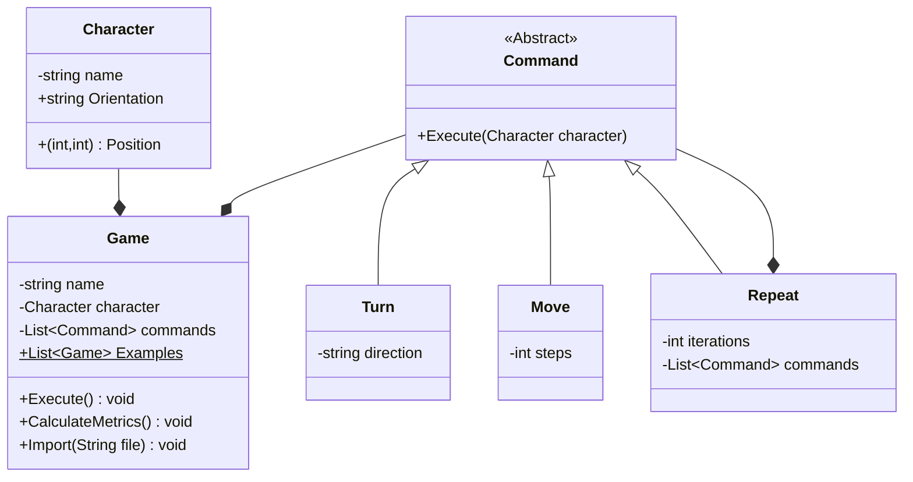

```mermaid
classDiagram
    Command --* Game
    Command <|-- Turn
    Command <|-- Move
    Command <|-- Repeat
    Command --* Repeat
    Character --* Game

    class Command{
        <<Abstract>>
        +Execute(Character character)
    }
    class Turn{
        -string direction
    }
    class Move{
        -int steps
    }
    class Repeat{
        -int iterations
        -List~Command~ commands
    }
    class Character{
        -string name
        +(int,int) Position
        +string Orientation
    }
    class Game{
        -string name
        -Character character
        -List~Command~ commands
        +List~Game~ Examples$
        +Execute() void
        +CalculateMetrics() void
        +Import(String file) void
    }
```
