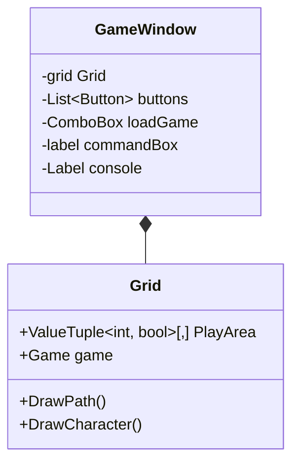

```mermaid
classDiagram

    GameWindow *-- Grid

    class GameWindow{
        -grid Grid
        %% make a note that the actual code contains individual buttons
        -List~Button~ buttons
        -ComboBox loadGame
        -label commandBox
        -Label console
    }

    class Grid{
        %% make a note for this tuple array
        +ValueTuple~int, bool~[,] PlayArea
        +Game game
        +DrawPath()
        +DrawCharacter()
    }
```
